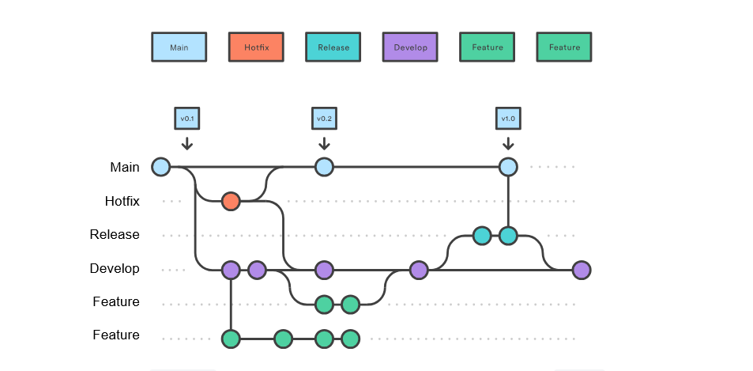

<div align=center>

# Git Workflow

_How this project does Git related activities_

</div>

## Branching

This project is using the Gitflow branching model as described by [Atlassian](https://www.atlassian.com/git/tutorials/comparing-workflows/gitflow-workflow). Refer to that article for an in-depth guide to this workflow.

### Branches Overview

- premanent branches
  - Main - production code
  - Develop - in development code
- temporary branches
  - Hotfix - fix production code
  - Release - ready code for production
  - Feature - add to codebase

### Table

> [!IMPORTANT] 
> Multiple valuse in the *Merge To* column must all be merged into at the same time

| Branch Name | Checkout To      | Merge To      |
| ----------- | ---------------- | ------------- |
| Main        | Hotfix           | -             |
| Develop     | Feature, Release | -             |
| Feature     | -                | Develop       |
| Hotfix      | -                | Main, Develop |
| Release     | -                | Main, Develop |

#### How to read the table:

Column ***Checkout To*** means we use column ***Branch Name*** to create this branch

```bash
# Branch Name = Main
# Checkout To = Hotfix
git checkout main_branch
git checkout -b hotfix_branch
```

Column ***Merge To*** means we merge column ***Branch Name*** into this branch

```bash
# Branch Name = Feature
# Merge To 	  = Develop
git checkout develop_branch
git merge feature_branch
git branch -D feature_branch
```


### Diagram

The diagram below shows how code travels between branches.

- Circles: a commit
- Lines between branches: code moving between branches via `git checkout` or `git merge`



## Commit Message

This convention is based on those described by [ConventionalCommits.org](https://www.conventionalcommits.org/en/v1.0.0/).

**Commit Structure**

<pre>
<b><a href="#types">&lt;type&gt;</a></b></font>(<b><a href="#scopes">&lt;optional scope&gt;</a></b>): <b><a href="#description">&lt;description&gt;</a></b>
<em>empty line</em>
<b><a href="#body">&lt;optional body&gt;</a></b>
<em>empty line</em>
<b><a href="#footer">&lt;optional footer&gt;</a></b>
</pre>

**Example Commit**

<pre>
docs(GIT_WORKFLOW.md): initial creation of file

document git related workflow to be more organized
</pre>

### Types

Types can be added/removed as needed. 
<!-- If removed, add to the second table. -->

| Type 		 | For 																	 											 | Example 
| - 	 		 | - 	 																	 											 | - 			 
| test  	 | add/correct tests 										 											 | changes to test files (filenames beginning with 'T') like TDashboard.java, not BaseTest.java 
| feat 		 | add/remove new API feature 					 											 | code in general that doesn't belong to other types 
| fix	 		 | API bug fix 													 											 | fixing previous API feature 
| refactor | code re(write/structure) that doesn't change API behavior 	 | modifying how a function does something without changing it's input/output, changing variable names 
| perf 		 | performance improving refactors 			 											 | adding caching/memoizing as an after-thought 
| style 	 | changes that do not affect the meaning of the code 				 | white-space, formatting, missing semi-colons, etc 
| docs  	 | documentation only changes 					 											 | doc comments, markdown files, etc 
| chore 	 | configs, pipeline, dependencies, project version						 | - 

<!-- Removed Types:
| Type 		 | For 																	 											 | Example | Became
| - 	 		 | - 	 																	 											 | - 			 | - -->

### Scopes

> [!NOTE] 
> Scopes can be wide or narrow. Try to narrow down as best as you can.

| Type 		 | Scope 																		 | Explained 
| - 	 		 | -																				 | -
| test  	 | test file's name  											 	 | should be local to 1 test file ( ex: TDashboard.java)
| feat 		 | directory name 													 | utils, resources, page-object-model
| fix	 		 | directory name or file name 						 	 | same as 'feat' type and/or just the file name
| refactor | file name(s) 														 | file name and/or just function name
| perf 		 | file name(s) and function name(s) 			 	 | narrow down to function name if possible
| style 	 | file name(s) or common ancestor directory | can be very wide because it doesn't affect functionality
| docs  	 | file name(s) 														 | can be wide
| chore 	 | file name(s) 														 | should be very narrow to minimize breaking changes